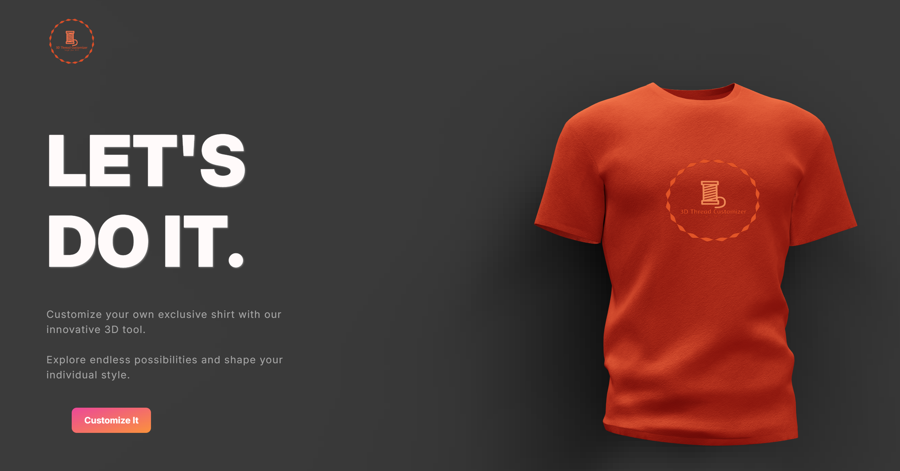
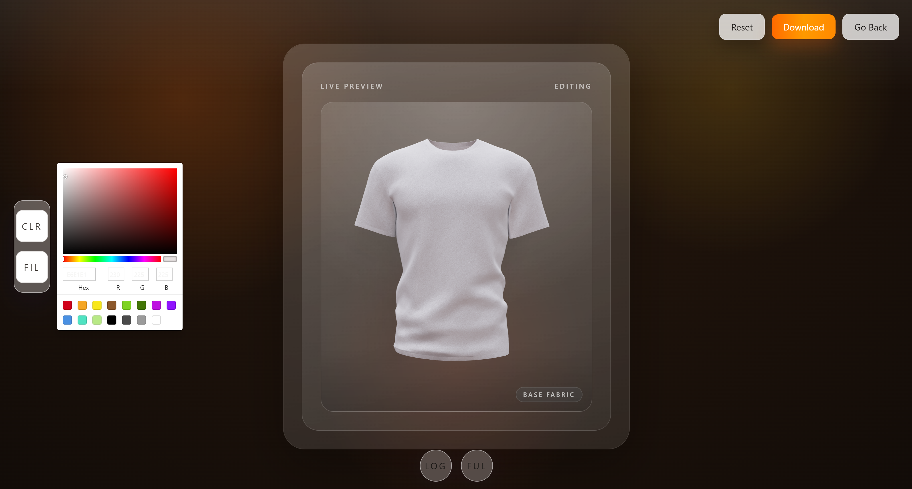
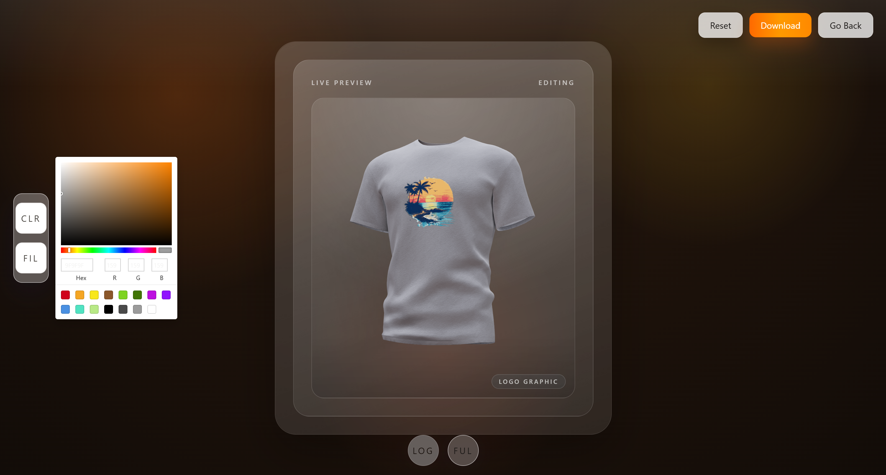
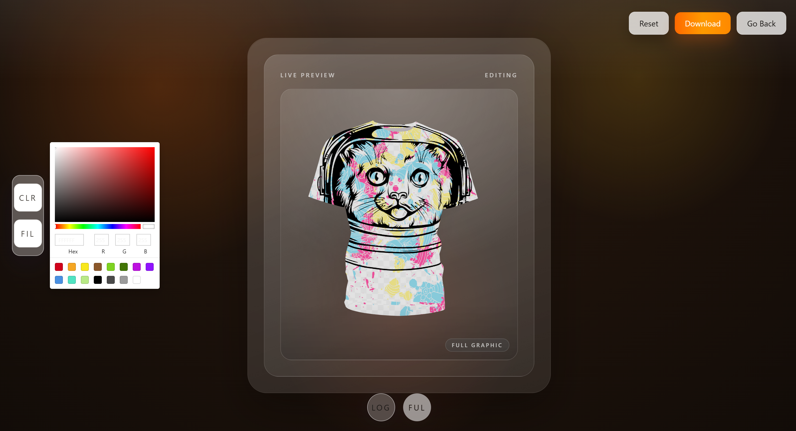
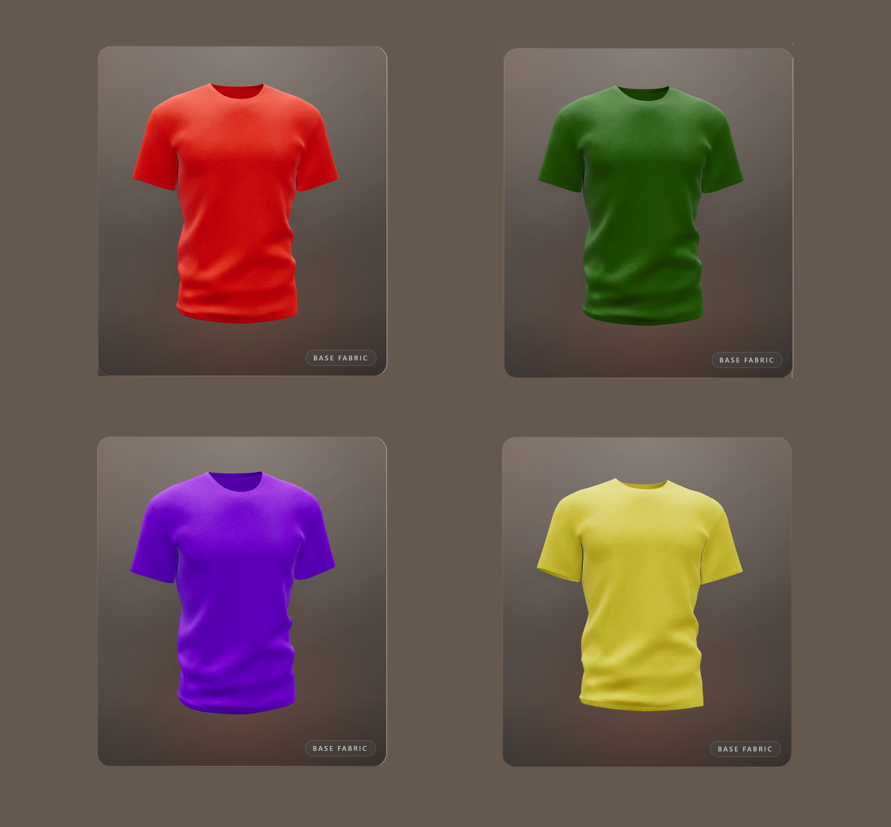

# 3D Thread Customizer

This repository contains a rebuilt version of a 3D shirt customizer.

Right now the project is frontend-only. The `frontend/` app is where the active work is happening. The `backend/` folder is just a placeholder for later.

## What it does

- renders a 3D shirt in the browser
- lets you change the shirt color
- lets you apply artwork as a chest logo or full-shirt graphic
- lets you remove, reset, and download the current design

## Screenshots







## Current stack

- React 19
- TypeScript
- Vite
- Tailwind CSS v4
- Framer Motion
- Valtio
- Three.js
- React Three Fiber
- Drei
- Maath

## Project layout

```text
3d-thread-customizer/
├─ backend/
├─ frontend/
│  ├─ public/
│  ├─ src/
│  │  ├─ app/
│  │  ├─ canvas/
│  │  ├─ components/
│  │  ├─ features/
│  │  ├─ lib/
│  │  ├─ store/
│  │  ├─ styles/
│  │  ├─ types/
│  │  └─ main.tsx
│  ├─ package.json
│  └─ vite.config.ts
└─ README.md
```

## Important frontend files

- `frontend/src/app/AppShell.tsx`
  Main shell for the landing view, preview frame, and lazy-loaded canvas.

- `frontend/src/features/customizer/components/Home.tsx`
  Intro section and entry point into the editor.

- `frontend/src/features/customizer/components/CustomizerPanel.tsx`
  Editor controls for color, upload, reset, download, and filter tabs.

- `frontend/src/canvas/components/CustomizerCanvas.tsx`
  Main React Three Fiber canvas.

- `frontend/src/canvas/components/CameraRig.tsx`
  Handles camera position and mouse-move tilt behavior.

- `frontend/src/canvas/components/ShirtModel.tsx`
  Loads the GLB shirt model and applies decals.

- `frontend/src/store/customizerStore.ts`
  Default state for the customizer.

## Run locally

From the repo root:

```bash
cd frontend
npm install
npm run dev
```

Build for production:

```bash
cd frontend
npm run build
```

Preview the production build:

```bash
cd frontend
npm run preview
```

## Scripts

Run these from `frontend/`.

| Script                 | What it does                             |
| ---------------------- | ---------------------------------------- |
| `npm run dev`          | Starts the Vite dev server               |
| `npm run build`        | Creates a production build               |
| `npm run preview`      | Serves the production build locally      |
| `npm run lint`         | Runs ESLint                              |
| `npm run format`       | Formats the codebase with Prettier       |
| `npm run format:check` | Checks formatting without changing files |

## Assets used by the app

- `frontend/public/shirt_baked.glb`
  Main shirt model.

- `frontend/public/3dtc-logo-v0.png`
  Current default decal/logo source used by the app state.

- `frontend/public/3dtc-logo-v1.svg`
  Alternate logo asset used in branding work.

- `frontend/public/results/`
  Sample screenshots used in this README.

## Current status

Implemented:

- landing page with live preview
- editor view
- color picker
- file upload
- logo and full-shirt decal application
- remove logo and full graphic controls
- reset design
- download preview as PNG
- lazy-loaded 3D canvas

Not implemented yet:

- backend API
- saved designs
- auth
- checkout or order flow
- AI image generation

## Notes

- The 3D canvas is loaded separately from the main app shell to improve startup time.
- The canvas bundle is still relatively heavy because of the 3D stack and model loading.
- Current work is mostly around interaction polish, visuals, and cleanup while the frontend gets finalized.
